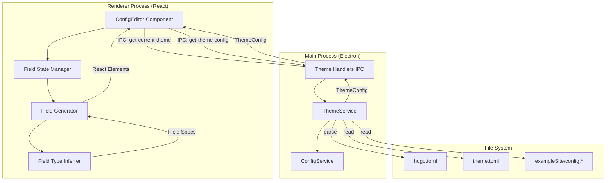
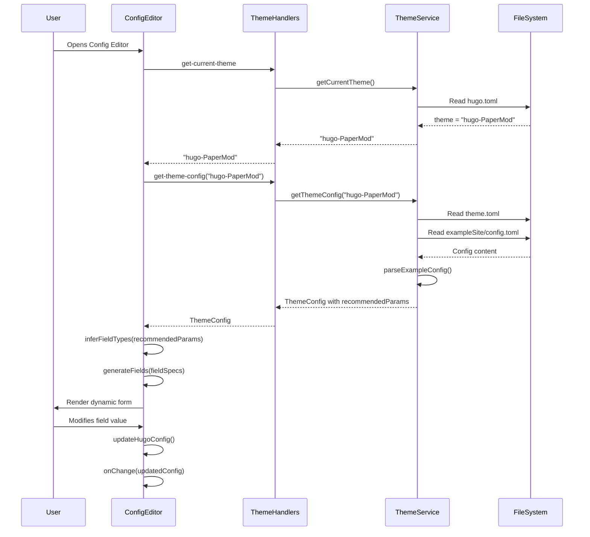

# Design Document: Dynamic Theme Config Editor

## Overview

This feature transforms the ConfigEditor component from a hardcoded PaperMod-specific configuration form into a dynamic, theme-aware configuration editor. The system will automatically detect the active Hugo theme and render appropriate configuration fields based on that theme's schema.

The design introduces a field type inference system that analyzes theme configuration parameters and generates appropriate UI controls (text inputs, number inputs, selects, dynamic lists) based on the parameter value types. This enables users to configure any Hugo theme without requiring custom UI code for each theme.

### Key Design Goals

1. **Dynamic Field Generation**: Automatically generate form fields from theme configuration schema
2. **Type Inference**: Intelligently determine field types from parameter values
3. **Backward Compatibility**: Maintain existing PaperMod configuration workflow
4. **Graceful Degradation**: Handle themes without configuration files
5. **Extensibility**: Support future theme-specific customizations

## Architecture

### High-Level System Architecture



### Component Interaction Flow



## Components and Interfaces

### 1. ConfigEditor Component (Enhanced)

**Location**: `blog-management-gui/src/renderer/components/styles/ConfigEditor.tsx`

**Responsibilities**:
- Fetch active theme and theme configuration on mount
- Generate dynamic form fields based on theme schema
- Manage form state for both common and theme-specific fields
- Handle theme switch events and re-render accordingly
- Preserve common configuration across theme switches

**State Structure**:
```typescript
interface ConfigEditorState {
  activeTheme: string | null;
  themeConfig: ThemeConfig | null;
  fieldSpecs: FieldSpec[];
  loading: boolean;
  error: string | null;
}
```

**Props** (unchanged):
```typescript
interface ConfigEditorProps {
  config: StyleConfiguration;
  onChange: (updates: Partial<StyleConfiguration>) => void;
}
```

### 2. Field Type Inferrer

**Purpose**: Analyze parameter values and determine appropriate UI field types

**Type Inference Rules**:
```typescript
type FieldType = 
  | 'text'           // string values
  | 'number'         // numeric values
  | 'boolean'        // boolean values
  | 'select'         // enum-like strings
  | 'array-string'   // array of strings
  | 'array-object'   // array of objects
  | 'object'         // nested objects
  | 'url'            // URL strings
  | 'color'          // color hex strings
  | 'textarea';      // long text strings

interface FieldSpec {
  key: string;
  label: string;
  type: FieldType;
  defaultValue: any;
  description?: string;
  required?: boolean;
  validation?: ValidationRule;
  nested?: FieldSpec[];  // for objects and arrays
}
```

**Inference Algorithm**:
```typescript
function inferFieldType(key: string, value: any): FieldType {
  // Boolean check
  if (typeof value === 'boolean') return 'boolean';
  
  // Number check
  if (typeof value === 'number') return 'number';
  
  // Array checks
  if (Array.isArray(value)) {
    if (value.length === 0) return 'array-string';
    if (typeof value[0] === 'object') return 'array-object';
    return 'array-string';
  }
  
  // Object check
  if (typeof value === 'object' && value !== null) return 'object';
  
  // String specializations
  if (typeof value === 'string') {
    // URL detection
    if (key.toLowerCase().includes('url') || 
        value.startsWith('http://') || 
        value.startsWith('https://')) {
      return 'url';
    }
    
    // Color detection
    if (key.toLowerCase().includes('color') && 
        /^#[0-9A-Fa-f]{6}$/.test(value)) {
      return 'color';
    }
    
    // Long text detection
    if (value.length > 100 || value.includes('\n')) {
      return 'textarea';
    }
    
    return 'text';
  }
  
  return 'text'; // fallback
}
```

### 3. Field Generator

**Purpose**: Generate React form elements from FieldSpec definitions

**Component Mapping**:
```typescript
const FIELD_COMPONENTS: Record<FieldType, React.ComponentType<any>> = {
  'text': TextInput,
  'number': NumberInput,
  'boolean': BooleanSelect,
  'textarea': TextAreaInput,
  'url': UrlInput,
  'color': ColorInput,
  'array-string': StringArrayEditor,
  'array-object': ObjectArrayEditor,
  'object': ObjectEditor,
  'select': SelectInput
};
```

**Generation Logic**:
```typescript
function generateField(spec: FieldSpec, value: any, onChange: (v: any) => void): React.ReactNode {
  const Component = FIELD_COMPONENTS[spec.type];
  
  return (
    <Form.Item
      key={spec.key}
      label={spec.label}
      required={spec.required}
      help={spec.description}
    >
      <Component
        value={value}
        onChange={onChange}
        spec={spec}
      />
    </Form.Item>
  );
}
```

### 4. Theme Configuration Parser (Enhanced ThemeService)

**Location**: `blog-management-gui/src/main/services/ThemeService.ts`

**Enhanced Methods**:

```typescript
class ThemeService {
  /**
   * Parse theme configuration with enhanced parameter extraction
   * Extracts nested objects, arrays, and complex structures
   */
  private parseExampleConfig(content: string, themeName: string): ThemeConfig {
    // Enhanced TOML parsing with nested structure support
    // Extract [params], [params.homeInfoParams], [params.socialIcons], etc.
  }
  
  /**
   * Parse YAML configuration with nested structure support
   */
  private parseExampleYamlConfig(content: string, themeName: string): ThemeConfig {
    // Enhanced YAML parsing with nested structure support
  }
  
  /**
   * Extract parameter descriptions from configuration comments
   */
  private extractParameterDescriptions(content: string): Record<string, string> {
    // Parse comments above parameter definitions
    // Format: # Description text\nparamName = value
  }
}
```

### 5. IPC Handlers (Enhanced)

**Location**: `blog-management-gui/src/main/ipc/theme-handlers.ts`

**New/Enhanced Handlers**:
```typescript
// Existing handler - no changes needed
ipcMain.handle('theme:get-current-theme', async () => {
  return await themeService.getCurrentTheme();
});

// Existing handler - no changes needed
ipcMain.handle('theme:get-theme-config', async (_, themeName: string) => {
  return await themeService.getThemeConfig(themeName);
});

// New handler for theme change notifications
ipcMain.on('theme:switched', (event, themeName: string) => {
  // Broadcast to all renderer windows
  BrowserWindow.getAllWindows().forEach(window => {
    window.webContents.send('theme:changed', themeName);
  });
});
```

## Data Models

### ThemeConfig (Enhanced)

```typescript
interface ThemeConfig {
  name: string;
  minHugoVersion?: string;
  requiredParams?: Record<string, any>;
  recommendedParams?: Record<string, any>;
  paramDescriptions?: Record<string, string>;  // NEW
  features?: string[];
  exampleConfig?: string;
}
```

### FieldSpec

```typescript
interface FieldSpec {
  key: string;                    // Parameter key (e.g., "ShowReadingTime")
  label: string;                  // Display label (e.g., "Show Reading Time")
  type: FieldType;                // Inferred field type
  defaultValue: any;              // Default value from theme config
  description?: string;           // Help text from comments
  required?: boolean;             // Whether field is required
  validation?: ValidationRule;    // Validation rules
  nested?: FieldSpec[];           // Nested fields for objects/arrays
  placeholder?: string;           // Placeholder text
}

interface ValidationRule {
  pattern?: RegExp;
  min?: number;
  max?: number;
  minLength?: number;
  maxLength?: number;
  custom?: (value: any) => boolean;
  message?: string;
}
```

### StyleConfiguration (Unchanged)

```typescript
interface StyleConfiguration {
  hugoConfig: HugoConfig;
}

interface HugoConfig {
  title?: string;
  baseURL?: string;
  languageCode?: string;
  theme?: string;
  params?: Record<string, any>;  // Dynamic theme-specific params
  menu?: {
    main?: MenuItem[];
  };
}
```

## Low-Level Design

### Hook: useThemeConfig

**Purpose**: Manage theme configuration loading and caching

```typescript
function useThemeConfig(themeName: string | null): {
  themeConfig: ThemeConfig | null;
  loading: boolean;
  error: Error | null;
  refetch: () => void;
} {
  const [themeConfig, setThemeConfig] = useState<ThemeConfig | null>(null);
  const [loading, setLoading] = useState(false);
  const [error, setError] = useState<Error | null>(null);
  
  const fetchThemeConfig = useCallback(async () => {
    if (!themeName) return;
    
    setLoading(true);
    setError(null);
    
    try {
      const config = await window.electron.ipcRenderer.invoke(
        'theme:get-theme-config',
        themeName
      );
      setThemeConfig(config);
    } catch (err) {
      setError(err as Error);
      setThemeConfig(null);
    } finally {
      setLoading(false);
    }
  }, [themeName]);
  
  useEffect(() => {
    fetchThemeConfig();
  }, [fetchThemeConfig]);
  
  return { themeConfig, loading, error, refetch: fetchThemeConfig };
}
```

### Hook: useFieldSpecs

**Purpose**: Generate field specifications from theme configuration

```typescript
function useFieldSpecs(themeConfig: ThemeConfig | null): FieldSpec[] {
  return useMemo(() => {
    if (!themeConfig?.recommendedParams) return [];
    
    return Object.entries(themeConfig.recommendedParams).map(([key, value]) => {
      const type = inferFieldType(key, value);
      const label = formatLabel(key);
      const description = themeConfig.paramDescriptions?.[key];
      
      const spec: FieldSpec = {
        key,
        label,
        type,
        defaultValue: value,
        description,
        required: themeConfig.requiredParams?.hasOwnProperty(key) ?? false
      };
      
      // Handle nested structures
      if (type === 'object' && typeof value === 'object') {
        spec.nested = Object.entries(value).map(([nestedKey, nestedValue]) => ({
          key: nestedKey,
          label: formatLabel(nestedKey),
          type: inferFieldType(nestedKey, nestedValue),
          defaultValue: nestedValue
        }));
      }
      
      if (type === 'array-object' && Array.isArray(value) && value.length > 0) {
        const firstItem = value[0];
        spec.nested = Object.entries(firstItem).map(([nestedKey, nestedValue]) => ({
          key: nestedKey,
          label: formatLabel(nestedKey),
          type: inferFieldType(nestedKey, nestedValue),
          defaultValue: nestedValue
        }));
      }
      
      return spec;
    });
  }, [themeConfig]);
}
```

### Utility: formatLabel

**Purpose**: Convert camelCase/snake_case parameter names to readable labels

```typescript
function formatLabel(key: string): string {
  // Handle common abbreviations
  const abbreviations: Record<string, string> = {
    'url': 'URL',
    'html': 'HTML',
    'css': 'CSS',
    'js': 'JavaScript',
    'seo': 'SEO',
    'rss': 'RSS',
    'api': 'API'
  };
  
  // Split on capital letters or underscores
  const words = key
    .replace(/([A-Z])/g, ' $1')
    .replace(/_/g, ' ')
    .trim()
    .split(/\s+/);
  
  // Capitalize and handle abbreviations
  return words
    .map(word => {
      const lower = word.toLowerCase();
      return abbreviations[lower] || 
             word.charAt(0).toUpperCase() + word.slice(1).toLowerCase();
    })
    .join(' ');
}
```

### Component: DynamicFieldRenderer

**Purpose**: Render a single dynamic field based on FieldSpec

```typescript
interface DynamicFieldRendererProps {
  spec: FieldSpec;
  value: any;
  onChange: (value: any) => void;
  path: string[];  // For nested field paths
}

const DynamicFieldRenderer: React.FC<DynamicFieldRendererProps> = ({
  spec,
  value,
  onChange,
  path
}) => {
  const handleChange = (newValue: any) => {
    onChange(newValue);
  };
  
  // Render based on field type
  switch (spec.type) {
    case 'text':
    case 'url':
      return (
        <Input
          value={value ?? spec.defaultValue ?? ''}
          onChange={(e) => handleChange(e.target.value)}
          placeholder={spec.placeholder}
        />
      );
    
    case 'number':
      return (
        <Input
          type="number"
          value={value ?? spec.defaultValue ?? 0}
          onChange={(e) => handleChange(parseInt(e.target.value, 10))}
        />
      );
    
    case 'boolean':
      return (
        <Select
          value={value ?? spec.defaultValue ?? false ? 'true' : 'false'}
          onChange={(v) => handleChange(v === 'true')}
        >
          <Select.Option value="true">Yes</Select.Option>
          <Select.Option value="false">No</Select.Option>
        </Select>
      );
    
    case 'textarea':
      return (
        <Input.TextArea
          value={value ?? spec.defaultValue ?? ''}
          onChange={(e) => handleChange(e.target.value)}
          rows={4}
        />
      );
    
    case 'array-string':
      return (
        <StringArrayEditor
          value={value ?? spec.defaultValue ?? []}
          onChange={handleChange}
        />
      );
    
    case 'array-object':
      return (
        <ObjectArrayEditor
          value={value ?? spec.defaultValue ?? []}
          onChange={handleChange}
          itemSpec={spec.nested ?? []}
        />
      );
    
    case 'object':
      return (
        <ObjectEditor
          value={value ?? spec.defaultValue ?? {}}
          onChange={handleChange}
          fieldSpecs={spec.nested ?? []}
        />
      );
    
    default:
      return <Input value={value ?? ''} onChange={(e) => handleChange(e.target.value)} />;
  }
};
```

### Component: ObjectArrayEditor

**Purpose**: Render a dynamic list of objects with add/remove controls

```typescript
interface ObjectArrayEditorProps {
  value: any[];
  onChange: (value: any[]) => void;
  itemSpec: FieldSpec[];
}

const ObjectArrayEditor: React.FC<ObjectArrayEditorProps> = ({
  value,
  onChange,
  itemSpec
}) => {
  const addItem = () => {
    const newItem = itemSpec.reduce((acc, spec) => {
      acc[spec.key] = spec.defaultValue;
      return acc;
    }, {} as Record<string, any>);
    
    onChange([...value, newItem]);
  };
  
  const removeItem = (index: number) => {
    onChange(value.filter((_, i) => i !== index));
  };
  
  const updateItem = (index: number, field: string, fieldValue: any) => {
    const newValue = [...value];
    newValue[index] = { ...newValue[index], [field]: fieldValue };
    onChange(newValue);
  };
  
  return (
    <Space direction="vertical" style={{ width: '100%' }}>
      {value.map((item, index) => (
        <Card key={index} size="small">
          <Space direction="vertical" style={{ width: '100%' }}>
            {itemSpec.map(spec => (
              <Form.Item key={spec.key} label={spec.label} style={{ marginBottom: 8 }}>
                <DynamicFieldRenderer
                  spec={spec}
                  value={item[spec.key]}
                  onChange={(v) => updateItem(index, spec.key, v)}
                  path={[String(index), spec.key]}
                />
              </Form.Item>
            ))}
            <Button
              danger
              icon={<DeleteOutlined />}
              onClick={() => removeItem(index)}
              size="small"
            >
              Remove
            </Button>
          </Space>
        </Card>
      ))}
      <Button
        type="dashed"
        icon={<PlusOutlined />}
        onClick={addItem}
        block
      >
        Add Item
      </Button>
    </Space>
  );
};
```

### Enhanced ConfigEditor Structure

```typescript
const ConfigEditor: React.FC<ConfigEditorProps> = ({ config, onChange }) => {
  // Fetch active theme
  const [activeTheme, setActiveTheme] = useState<string | null>(null);
  
  useEffect(() => {
    const fetchActiveTheme = async () => {
      const theme = await window.electron.ipcRenderer.invoke('theme:get-current-theme');
      setActiveTheme(theme);
    };
    fetchActiveTheme();
    
    // Listen for theme changes
    const unsubscribe = window.electron.ipcRenderer.on('theme:changed', (themeName) => {
      setActiveTheme(themeName);
    });
    
    return unsubscribe;
  }, []);
  
  // Fetch theme configuration
  const { themeConfig, loading, error } = useThemeConfig(activeTheme);
  
  // Generate field specifications
  const fieldSpecs = useFieldSpecs(themeConfig);
  
  // Handlers for common fields (unchanged)
  const handleHugoConfigChange = (field: string, value: any) => { /* ... */ };
  const handleParamsChange = (field: string, value: any) => { /* ... */ };
  
  // Handler for dynamic theme fields
  const handleThemeParamChange = (key: string, value: any) => {
    onChange({
      hugoConfig: {
        ...config.hugoConfig,
        params: {
          ...(config.hugoConfig.params || {}),
          [key]: value
        }
      }
    });
  };
  
  if (loading) {
    return <Spin tip="Loading theme configuration..." />;
  }
  
  if (error) {
    return (
      <Alert
        type="warning"
        message="Failed to load theme configuration"
        description="Showing basic configuration options only."
      />
    );
  }
  
  return (
    <Space direction="vertical" size="large" style={{ width: '100%' }}>
      {/* Common sections - always rendered */}
      <Card title="Site Basic Information" size="small">
        {/* Existing basic info fields */}
      </Card>
      
      <Card title="Navigation Menu" size="small">
        {/* Existing menu fields */}
      </Card>
      
      {/* Dynamic theme-specific sections */}
      {fieldSpecs.length > 0 && (
        <Card title={`${activeTheme} Theme Configuration`} size="small">
          <Form layout="vertical">
            {fieldSpecs.map(spec => (
              <Form.Item
                key={spec.key}
                label={spec.label}
                required={spec.required}
                help={spec.description}
              >
                <DynamicFieldRenderer
                  spec={spec}
                  value={config.hugoConfig.params?.[spec.key]}
                  onChange={(v) => handleThemeParamChange(spec.key, v)}
                  path={[spec.key]}
                />
              </Form.Item>
            ))}
          </Form>
        </Card>
      )}
      
      {/* Fallback message if no theme config */}
      {fieldSpecs.length === 0 && themeConfig && (
        <Alert
          type="info"
          message="No Theme-Specific Configuration"
          description="This theme does not provide additional configuration options."
        />
      )}
    </Space>
  );
};
```

### Enhanced ThemeService Parser

**Algorithm for Enhanced TOML Parsing**:

```typescript
private parseExampleConfig(content: string, themeName: string): ThemeConfig {
  const config: ThemeConfig = {
    name: themeName,
    exampleConfig: content,
    paramDescriptions: {}
  };

  // Extract all [params.*] sections
  const sections = this.extractTomlSections(content, 'params');
  const recommendedParams: Record<string, any> = {};
  
  for (const [sectionPath, sectionContent] of Object.entries(sections)) {
    const params = this.parseTomlSection(sectionContent);
    
    if (sectionPath === 'params') {
      // Top-level params
      Object.assign(recommendedParams, params);
    } else {
      // Nested params (e.g., params.homeInfoParams)
      const nestedKey = sectionPath.replace('params.', '');
      recommendedParams[nestedKey] = params;
    }
  }
  
  // Extract parameter descriptions from comments
  config.paramDescriptions = this.extractParameterDescriptions(content);
  
  if (Object.keys(recommendedParams).length > 0) {
    config.recommendedParams = recommendedParams;
  }
  
  return config;
}

private extractTomlSections(
  content: string, 
  prefix: string
): Record<string, string> {
  const sections: Record<string, string> = {};
  const lines = content.split('\n');
  let currentSection: string | null = null;
  let currentContent: string[] = [];
  
  for (const line of lines) {
    const sectionMatch = line.match(/^\[([^\]]+)\]/);
    
    if (sectionMatch) {
      // Save previous section
      if (currentSection && currentContent.length > 0) {
        sections[currentSection] = currentContent.join('\n');
      }
      
      // Start new section
      const sectionName = sectionMatch[1];
      if (sectionName.startsWith(prefix)) {
        currentSection = sectionName;
        currentContent = [];
      } else {
        currentSection = null;
      }
    } else if (currentSection) {
      currentContent.push(line);
    }
  }
  
  // Save last section
  if (currentSection && currentContent.length > 0) {
    sections[currentSection] = currentContent.join('\n');
  }
  
  return sections;
}

private parseTomlSection(content: string): Record<string, any> {
  const params: Record<string, any> = {};
  const lines = content.split('\n');
  
  for (const line of lines) {
    const trimmed = line.trim();
    if (!trimmed || trimmed.startsWith('#')) continue;
    
    // Handle arrays: key = ["value1", "value2"]
    const arrayMatch = trimmed.match(/^(\w+)\s*=\s*\[(.*)\]$/);
    if (arrayMatch) {
      const key = arrayMatch[1];
      const arrayContent = arrayMatch[2];
      const values = arrayContent
        .split(',')
        .map(v => v.trim().replace(/^["']|["']$/g, ''))
        .filter(v => v.length > 0);
      params[key] = values;
      continue;
    }
    
    // Handle simple key-value pairs
    const match = trimmed.match(/^(\w+)\s*=\s*(.+)$/);
    if (match) {
      const key = match[1];
      let value: any = match[2].trim();
      
      // Remove quotes
      if ((value.startsWith('"') && value.endsWith('"')) || 
          (value.startsWith("'") && value.endsWith("'"))) {
        value = value.slice(1, -1);
      }
      
      // Parse boolean
      if (value === 'true') value = true;
      if (value === 'false') value = false;
      
      // Parse number
      if (/^\d+$/.test(value)) value = parseInt(value, 10);
      if (/^\d+\.\d+$/.test(value)) value = parseFloat(value);
      
      params[key] = value;
    }
  }
  
  return params;
}

private extractParameterDescriptions(content: string): Record<string, string> {
  const descriptions: Record<string, string> = {};
  const lines = content.split('\n');
  let currentComment = '';
  
  for (let i = 0; i < lines.length; i++) {
    const line = lines[i].trim();
    
    // Accumulate comment lines
    if (line.startsWith('#')) {
      const commentText = line.substring(1).trim();
      currentComment += (currentComment ? ' ' : '') + commentText;
      continue;
    }
    
    // Check if next line is a parameter definition
    const paramMatch = line.match(/^(\w+)\s*=/);
    if (paramMatch && currentComment) {
      descriptions[paramMatch[1]] = currentComment;
      currentComment = '';
    } else if (line && !line.startsWith('[')) {
      // Reset comment if we hit a non-comment, non-param line
      currentComment = '';
    }
  }
  
  return descriptions;
}
```


## Correctness Properties

*A property is a characteristic or behavior that should hold true across all valid executions of a system—essentially, a formal statement about what the system should do. Properties serve as the bridge between human-readable specifications and machine-verifiable correctness guarantees.*

### Property Reflection

After analyzing all acceptance criteria, I identified several areas where properties can be consolidated:

**Type Inference Properties (2.2, 8.1-8.5)**: These all relate to the same type inference system. Rather than having separate properties for each type, we can have one comprehensive property that validates the entire type inference mapping.

**Rendering Properties (2.1, 2.4, 2.5)**: These are all about rendering fields based on parameter structure. They can be combined into a single property about field generation.

**Common Section Properties (3.1, 3.2)**: Both ensure common sections are always present. These can be combined into one property.

**State Update Properties (4.1, 4.2, 4.3)**: These all relate to how state updates flow through the system. They can be combined into a comprehensive state update property.

**Description Display Properties (6.1, 6.2, 6.4)**: These all relate to displaying help text and can be combined.

**Parsing Properties (10.1, 10.2, 10.3)**: These all relate to ThemeService parsing and can be combined into comprehensive parsing properties.

### Property 1: Type Inference Correctness

*For any* theme parameter with a value of a specific type (string, number, boolean, array of strings, array of objects, object), the field type inference system should map it to the correct FieldType according to the inference rules.

**Validates: Requirements 2.2, 8.1, 8.2, 8.3, 8.4, 8.5**

### Property 2: Field Generation Completeness

*For any* ThemeConfig with recommendedParams, the ConfigEditor should generate exactly one form field for each parameter, with nested fields generated for object and array parameters.

**Validates: Requirements 2.1, 2.4, 2.5**

### Property 3: Label Formatting Consistency

*For any* parameter name in camelCase or snake_case format, the formatLabel function should convert it to Title Case with proper handling of common abbreviations (URL, HTML, CSS, etc.).

**Validates: Requirements 2.3**

### Property 4: Common Sections Always Present

*For any* theme configuration (including null or empty), the ConfigEditor should always render both the "Site Basic Information" section and the "Navigation Menu" section.

**Validates: Requirements 3.1, 3.2**

### Property 5: Section Ordering Invariant

*For any* theme configuration with theme-specific parameters, all theme-specific sections should appear after all common sections in the rendered output.

**Validates: Requirements 3.3**

### Property 6: Menu and Social Icon Operations Preserved

*For any* menu or social icon operation (add, remove, update), the ConfigEditor should maintain the same behavior as the original implementation.

**Validates: Requirements 3.4**

### Property 7: State Update Completeness

*For any* theme-specific field modification, the onChange callback should be invoked with a complete Hugo_Config object that includes the updated parameter while preserving the original structure (nested objects, arrays, etc.).

**Validates: Requirements 4.1, 4.2, 4.3**

### Property 8: Required Field Validation

*For any* theme parameter marked as required, the ConfigEditor should prevent saving when that parameter is empty or undefined.

**Validates: Requirements 4.4**

### Property 9: Common Values Preservation Across Theme Switch

*For any* theme switch operation, the common configuration values (title, description, author, language, menu) should remain unchanged in the Hugo_Config after the switch completes.

**Validates: Requirements 5.4**

### Property 10: Description Display Mapping

*For any* theme parameter, if a description exists in paramDescriptions, it should be displayed as help text; if no description exists, only the label should be displayed without help text.

**Validates: Requirements 6.1, 6.2, 6.4**

### Property 11: ThemeService Parsing Round Trip

*For any* valid TOML or YAML theme configuration file, parsing it with ThemeService should extract all parameters from the [params] section (or params: section in YAML), and the returned ThemeConfig should contain all parameter names, their values, and their types.

**Validates: Requirements 10.1, 10.2, 10.4**

### Property 12: Comment Extraction Accuracy

*For any* theme configuration file with comments preceding parameter definitions, the ThemeService should extract those comments and map them to the correct parameter names in paramDescriptions.

**Validates: Requirements 10.3**

## Error Handling

### Error Scenarios and Responses

1. **Theme Config Fetch Failure**
   - **Scenario**: IPC call to `theme:get-theme-config` fails or returns null
   - **Response**: Display error alert, fall back to common sections only, log warning
   - **User Impact**: User can still edit basic site configuration

2. **Invalid Theme Config Structure**
   - **Scenario**: ThemeConfig has malformed recommendedParams
   - **Response**: Skip malformed parameters, render valid ones, log errors
   - **User Impact**: Partial theme configuration available

3. **Type Inference Failure**
   - **Scenario**: Parameter value is of unexpected type (e.g., function, symbol)
   - **Response**: Fall back to text input, log warning
   - **User Impact**: Field rendered as text input

4. **Nested Structure Too Deep**
   - **Scenario**: Object nesting exceeds reasonable depth (>3 levels)
   - **Response**: Flatten to 3 levels, log warning
   - **User Impact**: Deep nesting simplified

5. **Theme Switch During Edit**
   - **Scenario**: User switches theme while editing configuration
   - **Response**: Preserve common fields, discard theme-specific unsaved changes, show confirmation dialog
   - **User Impact**: Unsaved theme-specific changes lost (by design)

6. **IPC Communication Failure**
   - **Scenario**: Electron IPC channel unavailable
   - **Response**: Display error message, disable theme-specific features
   - **User Impact**: Cannot load theme configurations

7. **Parsing Error in ThemeService**
   - **Scenario**: TOML/YAML parsing fails due to syntax errors
   - **Response**: Return null, log detailed error with line number
   - **User Impact**: Theme has no specific configuration options

### Error Recovery Strategies

```typescript
// Graceful degradation for theme config loading
async function loadThemeConfigSafely(themeName: string): Promise<ThemeConfig | null> {
  try {
    const config = await window.electron.ipcRenderer.invoke(
      'theme:get-theme-config',
      themeName
    );
    return config;
  } catch (error) {
    console.error('Failed to load theme config:', error);
    // Show user-friendly error
    message.warning('Could not load theme configuration. Using basic settings.');
    return null;
  }
}

// Fallback for type inference
function inferFieldTypeSafely(key: string, value: any): FieldType {
  try {
    return inferFieldType(key, value);
  } catch (error) {
    console.warn(`Type inference failed for ${key}:`, error);
    return 'text'; // Safe fallback
  }
}

// Validation with error collection
function validateConfig(config: HugoConfig, requiredParams: string[]): ValidationResult {
  const errors: string[] = [];
  
  for (const param of requiredParams) {
    if (!config.params?.[param]) {
      errors.push(`Required parameter "${param}" is missing`);
    }
  }
  
  return {
    valid: errors.length === 0,
    errors
  };
}
```

## Testing Strategy

### Dual Testing Approach

This feature requires both unit tests and property-based tests to ensure comprehensive coverage:

**Unit Tests** focus on:
- Specific examples of type inference (e.g., "ShowReadingTime" → boolean)
- Component mounting and lifecycle behavior
- IPC communication mocking
- Error boundary behavior
- Backward compatibility with PaperMod theme
- Theme switch event handling

**Property-Based Tests** focus on:
- Type inference correctness across all possible parameter types
- Field generation for arbitrary theme configurations
- Label formatting for arbitrary parameter names
- State update integrity for arbitrary field modifications
- Common section preservation across arbitrary theme switches
- Parsing correctness for arbitrary valid TOML/YAML files

### Property-Based Testing Configuration

**Library**: fast-check (JavaScript/TypeScript property-based testing library)

**Configuration**:
- Minimum 100 iterations per property test
- Each test tagged with feature name and property number
- Custom generators for ThemeConfig, HugoConfig, and parameter values

**Tag Format**: 
```typescript
// Feature: dynamic-theme-config-editor, Property 1: Type Inference Correctness
```

### Test Structure

```typescript
// Example property test structure
describe('Property 1: Type Inference Correctness', () => {
  it('should correctly infer field types for all parameter value types', () => {
    fc.assert(
      fc.property(
        fc.record({
          stringParam: fc.string(),
          numberParam: fc.integer(),
          booleanParam: fc.boolean(),
          arrayParam: fc.array(fc.string()),
          objectParam: fc.record({ nested: fc.string() })
        }),
        (params) => {
          expect(inferFieldType('stringParam', params.stringParam)).toBe('text');
          expect(inferFieldType('numberParam', params.numberParam)).toBe('number');
          expect(inferFieldType('booleanParam', params.booleanParam)).toBe('boolean');
          expect(inferFieldType('arrayParam', params.arrayParam)).toBe('array-string');
          expect(inferFieldType('objectParam', params.objectParam)).toBe('object');
        }
      ),
      { numRuns: 100 }
    );
  });
});

// Example unit test structure
describe('ConfigEditor Component', () => {
  it('should fetch active theme on mount', async () => {
    const mockInvoke = jest.fn().mockResolvedValue('hugo-PaperMod');
    window.electron = { ipcRenderer: { invoke: mockInvoke } };
    
    render(<ConfigEditor config={mockConfig} onChange={jest.fn()} />);
    
    await waitFor(() => {
      expect(mockInvoke).toHaveBeenCalledWith('theme:get-current-theme');
    });
  });
  
  it('should display error message when theme config fetch fails', async () => {
    const mockInvoke = jest.fn()
      .mockResolvedValueOnce('hugo-PaperMod')
      .mockRejectedValueOnce(new Error('Network error'));
    
    window.electron = { ipcRenderer: { invoke: mockInvoke } };
    
    render(<ConfigEditor config={mockConfig} onChange={jest.fn()} />);
    
    await waitFor(() => {
      expect(screen.getByText(/failed to load theme configuration/i)).toBeInTheDocument();
    });
  });
});
```

### Custom Generators for Property Tests

```typescript
// Generator for valid theme configurations
const themeConfigArbitrary = fc.record({
  name: fc.string(),
  recommendedParams: fc.dictionary(
    fc.string(),
    fc.oneof(
      fc.string(),
      fc.integer(),
      fc.boolean(),
      fc.array(fc.string()),
      fc.array(fc.record({ name: fc.string(), url: fc.string() })),
      fc.record({ nested: fc.string() })
    )
  ),
  paramDescriptions: fc.option(fc.dictionary(fc.string(), fc.string()))
});

// Generator for Hugo configurations
const hugoConfigArbitrary = fc.record({
  title: fc.string(),
  languageCode: fc.string(),
  params: fc.dictionary(fc.string(), fc.anything())
});

// Generator for parameter names (camelCase, snake_case)
const paramNameArbitrary = fc.oneof(
  fc.stringOf(fc.constantFrom('a', 'b', 'c', 'A', 'B', 'C')), // camelCase
  fc.stringOf(fc.constantFrom('a', 'b', 'c', '_'))            // snake_case
);
```

### Test Coverage Goals

- **Unit Test Coverage**: >90% line coverage for ConfigEditor component
- **Property Test Coverage**: All 12 correctness properties implemented
- **Integration Test Coverage**: Theme switch workflow, IPC communication
- **Backward Compatibility**: All existing PaperMod tests pass

### Testing Priorities

1. **Critical Path**: Type inference, field generation, state updates
2. **Error Handling**: Graceful degradation, error messages
3. **Backward Compatibility**: PaperMod theme configuration
4. **Edge Cases**: Null configs, empty params, deep nesting
5. **Performance**: Rendering large theme configurations (>50 parameters)

