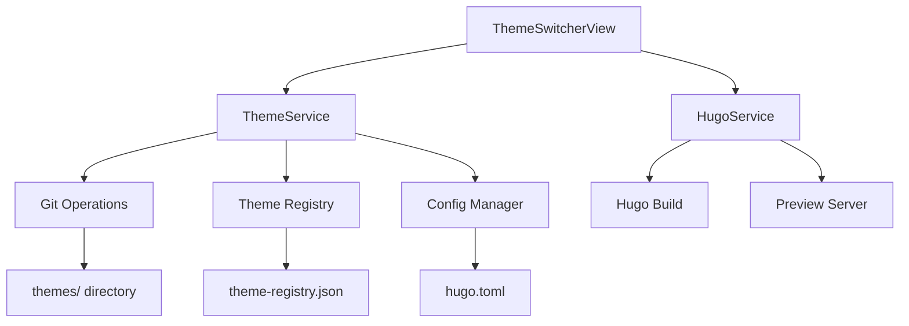

# Design Document: Hugo Theme Switcher

## Overview

Hugo Theme Switcher 功能为博客管理编辑器添加主题管理能力，允许用户在编辑器中浏览、切换、安装和预览 Hugo 主题。该功能集成到现有的样式编辑器中，通过 Git submodule 管理主题安装，自动更新 hugo.toml 配置文件，并提供主题预览功能。系统需要处理主题兼容性、配置迁移和错误恢复等复杂场景。

## Architecture



## Main Algorithm/Workflow

```mermaid
sequenceDiagram
    participant U as User
    participant V as ThemeSwitcherView
    participant S as ThemeService
    participant H as HugoService
    participant G as Git
    participant F as FileSystem
    
    U->>V: 选择主题
    V->>S: switchTheme(themeName)
    S->>F: 备份当前 hugo.toml
    S->>F: 读取主题配置要求
    S->>F: 更新 hugo.toml
    S->>H: 重启预览服务器
    H->>U: 显示新主题预览
    
    U->>V: 安装新主题
    V->>S: installTheme(repoUrl, themeName)
    S->>G: git submodule add
    S->>F: 下载主题到 themes/
    S->>S: 注册主题到 registry
    S->>V: 安装完成


## Components and Interfaces

### Component 1: ThemeService

**Purpose**: 管理 Hugo 主题的安装、切换、卸载和配置

**Interface**:
```typescript
interface ThemeService {
  // 获取已安装主题列表
  getInstalledThemes(): Promise<ThemeInfo[]>;
  
  // 获取当前激活的主题
  getCurrentTheme(): Promise<string>;
  
  // 切换主题
  switchTheme(themeName: string): Promise<void>;
  
  // 从 Git 仓库安装主题
  installTheme(repoUrl: string, themeName: string): Promise<void>;
  
  // 卸载主题
  uninstallTheme(themeName: string): Promise<void>;
  
  // 获取主题配置要求
  getThemeConfig(themeName: string): Promise<ThemeConfig | null>;
  
  // 获取主题注册表（推荐主题列表）
  getThemeRegistry(): Promise<ThemeRegistryEntry[]>;
}
```

**Responsibilities**:
- 扫描 themes/ 目录获取已安装主题
- 执行 Git submodule 操作安装/卸载主题
- 读写 hugo.toml 配置文件
- 管理主题注册表
- 备份和恢复配置

### Component 2: ThemeSwitcherView

**Purpose**: 提供主题管理的用户界面

**Interface**:
```typescript
interface ThemeSwitcherView extends React.FC {
  // 组件内部状态
  installedThemes: ThemeInfo[];
  currentTheme: string;
  registryThemes: ThemeRegistryEntry[];
  loading: boolean;
  
  // 事件处理
  handleThemeSwitch(themeName: string): Promise<void>;
  handleThemeInstall(repoUrl: string, themeName: string): Promise<void>;
  handleThemeUninstall(themeName: string): Promise<void>;
  handleThemePreview(themeName: string): Promise<void>;
}
```

**Responsibilities**:
- 显示已安装主题列表
- 显示推荐主题库
- 处理用户交互（切换、安装、卸载）
- 显示主题预览
- 错误提示和加载状态

### Component 3: GitSubmoduleManager

**Purpose**: 封装 Git submodule 操作

**Interface**:
```typescript
interface GitSubmoduleManager {
  // 添加 submodule
  addSubmodule(repoUrl: string, path: string): Promise<void>;
  
  // 移除 submodule
  removeSubmodule(path: string): Promise<void>;
  
  // 更新 submodule
  updateSubmodule(path: string): Promise<void>;
  
  // 列出所有 submodules
  listSubmodules(): Promise<SubmoduleInfo[]>;
}
```

**Responsibilities**:
- 执行 git submodule add/remove/update 命令
- 解析 .gitmodules 文件
- 处理 Git 操作错误

## Data Models

### Model 1: ThemeInfo

```typescript
interface ThemeInfo {
  // 主题名称（目录名）
  name: string;
  
  // 主题显示名称
  displayName: string;
  
  // 主题描述
  description?: string;
  
  // 主题版本
  version?: string;
  
  // 主题作者
  author?: string;
  
  // Git 仓库 URL
  repoUrl?: string;
  
  // 是否为当前激活主题
  isActive: boolean;
  
  // 主题路径
  path: string;
  
  // 主题配置文件路径（theme.toml）
  configPath?: string;
  
  // 主题截图
  screenshot?: string;
}
```

**Validation Rules**:
- name 必须是有效的目录名（不含特殊字符）
- path 必须在 themes/ 目录下
- repoUrl 必须是有效的 Git URL（如果提供）

### Model 2: ThemeConfig

```typescript
interface ThemeConfig {
  // 主题名称
  name: string;
  
  // 最小 Hugo 版本要求
  minHugoVersion?: string;
  
  // 必需的配置参数
  requiredParams?: Record<string, any>;
  
  // 推荐的配置参数
  recommendedParams?: Record<string, any>;
  
  // 主题特性
  features?: string[];
  
  // 配置示例
  exampleConfig?: string;
}
```

**Validation Rules**:
- name 不能为空
- minHugoVersion 必须符合语义化版本格式
- requiredParams 中的值必须有类型定义

### Model 3: ThemeRegistryEntry

```typescript
interface ThemeRegistryEntry {
  // 主题名称
  name: string;
  
  // 显示名称
  displayName: string;
  
  // 描述
  description: string;
  
  // Git 仓库 URL
  repoUrl: string;
  
  // 主题作者
  author: string;
  
  // 标签
  tags: string[];
  
  // 截图 URL
  screenshot?: string;
  
  // 演示站点 URL
  demoUrl?: string;
  
  // 是否推荐
  recommended?: boolean;
}
```

**Validation Rules**:
- repoUrl 必须是有效的 Git URL
- tags 数组不能为空
- demoUrl 必须是有效的 HTTP(S) URL（如果提供）

## Algorithmic Pseudocode

### Main Theme Switching Algorithm

```typescript
async function switchTheme(themeName: string): Promise<void> {
  // Preconditions:
  // - themeName is non-empty string
  // - Theme exists in themes/ directory
  // - hugo.toml file exists and is writable
  
  try {
    // Step 1: Validate theme exists
    const themeExists = await validateThemeExists(themeName);
    if (!themeExists) {
      throw new Error(`Theme ${themeName} not found`);
    }
    
    // Step 2: Backup current configuration
    const backupPath = await backupHugoConfig();
    
    // Step 3: Read theme configuration requirements
    const themeConfig = await getThemeConfig(themeName);
    
    // Step 4: Update hugo.toml
    await updateHugoConfig({
      theme: themeName,
      ...themeConfig?.requiredParams
    });
    
    // Step 5: Restart preview server if running
    if (await isPreviewServerRunning()) {
      await restartPreviewServer();
    }
    
    // Step 6: Verify theme loaded successfully
    const success = await verifyThemeLoaded(themeName);
    if (!success) {
      // Rollback on failure
      await restoreHugoConfig(backupPath);
      throw new Error('Theme failed to load');
    }
    
  } catch (error) {
    // Rollback and rethrow
    throw new Error(`Failed to switch theme: ${error.message}`);
  }
  
  // Postconditions:
  // - hugo.toml contains theme = themeName
  // - Preview server (if running) displays new theme
  // - Backup of previous config exists
}
```

**Preconditions**:
- themeName is a valid, non-empty string
- Theme directory exists at themes/{themeName}
- hugo.toml file is accessible and writable
- User has write permissions to Hugo project directory

**Postconditions**:
- hugo.toml updated with new theme name
- Previous configuration backed up
- Preview server restarted (if was running)
- Theme successfully loaded or error thrown with rollback

**Loop Invariants**: N/A (no loops in main algorithm)

### Theme Installation Algorithm

```typescript
async function installTheme(repoUrl: string, themeName: string): Promise<void> {
  // Preconditions:
  // - repoUrl is valid Git repository URL
  // - themeName is valid directory name
  // - Theme not already installed
  // - Git is available in system PATH
  
  try {
    // Step 1: Validate inputs
    if (!isValidGitUrl(repoUrl)) {
      throw new Error('Invalid Git repository URL');
    }
    if (!isValidThemeName(themeName)) {
      throw new Error('Invalid theme name');
    }
    
    // Step 2: Check if theme already exists
    const exists = await themeExists(themeName);
    if (exists) {
      throw new Error(`Theme ${themeName} already installed`);
    }
    
    // Step 3: Add Git submodule
    const themePath = `themes/${themeName}`;
    await gitSubmoduleAdd(repoUrl, themePath);
    
    // Step 4: Verify installation
    const installed = await verifyThemeInstalled(themeName);
    if (!installed) {
      // Cleanup on failure
      await removeDirectory(themePath);
      throw new Error('Theme installation verification failed');
    }
    
    // Step 5: Register theme in registry
    await registerTheme({
      name: themeName,
      repoUrl: repoUrl,
      installedAt: new Date()
    });
    
  } catch (error) {
    throw new Error(`Failed to install theme: ${error.message}`);
  }
  
  // Postconditions:
  // - Theme downloaded to themes/{themeName}
  // - Git submodule added to .gitmodules
  // - Theme registered in local registry
}
```

**Preconditions**:
- repoUrl is a valid, accessible Git repository URL
- themeName contains only valid filename characters
- Theme with same name not already installed
- Git command-line tool is installed and accessible
- Network connection available for Git clone

**Postconditions**:
- Theme files exist in themes/{themeName} directory
- .gitmodules file contains new submodule entry
- Theme registered in theme-registry.json
- On failure: partial installation cleaned up

**Loop Invariants**: N/A (no loops in main algorithm)

### Theme Scanning Algorithm

```typescript
async function scanInstalledThemes(): Promise<ThemeInfo[]> {
  // Preconditions:
  // - themes/ directory exists
  // - Read permissions on themes/ directory
  
  const themes: ThemeInfo[] = [];
  const themesDir = path.join(hugoProjectPath, 'themes');
  
  // Step 1: Read themes directory
  const entries = await fs.readdir(themesDir, { withFileTypes: true });
  
  // Step 2: Process each directory
  for (const entry of entries) {
    // Loop invariant: All processed themes are valid and added to themes array
    
    if (!entry.isDirectory()) {
      continue;
    }
    
    const themeName = entry.name;
    const themePath = path.join(themesDir, themeName);
    
    // Step 3: Read theme metadata
    const themeInfo = await readThemeMetadata(themePath, themeName);
    
    if (themeInfo) {
      themes.push(themeInfo);
    }
  }
  
  // Step 4: Sort themes by name
  themes.sort((a, b) => a.name.localeCompare(b.name));
  
  return themes;
  
  // Postconditions:
  // - Returns array of all valid themes in themes/ directory
  // - Array is sorted alphabetically by name
  // - Invalid themes are filtered out
}
```

**Preconditions**:
- themes/ directory exists in Hugo project
- Process has read permissions on themes/ directory
- Hugo project path is correctly configured

**Postconditions**:
- Returns array of ThemeInfo objects for all valid themes
- Array is sorted alphabetically by theme name
- Invalid or corrupted theme directories are skipped
- Empty array returned if no themes found

**Loop Invariants**:
- All themes processed so far are valid ThemeInfo objects
- themes array contains no duplicates
- All entries in themes array have unique names

## Key Functions with Formal Specifications

### Function 1: switchTheme()

```typescript
async function switchTheme(themeName: string): Promise<void>
```

**Preconditions:**
- themeName is non-empty string
- Theme exists in themes/ directory
- hugo.toml file exists and is writable
- User has write permissions

**Postconditions:**
- hugo.toml updated with theme = themeName
- Configuration backup created
- Preview server restarted if was running
- On failure: configuration rolled back

**Loop Invariants:** N/A

### Function 2: installTheme()

```typescript
async function installTheme(repoUrl: string, themeName: string): Promise<void>
```

**Preconditions:**
- repoUrl is valid Git repository URL
- themeName is valid directory name
- Theme not already installed
- Git available in PATH
- Network connection available

**Postconditions:**
- Theme downloaded to themes/{themeName}
- Git submodule added
- Theme registered in registry
- On failure: partial installation cleaned up

**Loop Invariants:** N/A

### Function 3: getInstalledThemes()

```typescript
async function getInstalledThemes(): Promise<ThemeInfo[]>
```

**Preconditions:**
- themes/ directory exists
- Read permissions on themes/ directory

**Postconditions:**
- Returns array of all valid themes
- Array sorted alphabetically
- Invalid themes filtered out

**Loop Invariants:**
- All processed themes are valid ThemeInfo objects
- No duplicate theme names in result

### Function 4: backupHugoConfig()

```typescript
async function backupHugoConfig(): Promise<string>
```

**Preconditions:**
- hugo.toml file exists
- Read permissions on hugo.toml
- Write permissions on backup directory

**Postconditions:**
- Backup file created with timestamp
- Returns path to backup file
- Original file unchanged

**Loop Invariants:** N/A

### Function 5: verifyThemeLoaded()

```typescript
async function verifyThemeLoaded(themeName: string): Promise<boolean>
```

**Preconditions:**
- themeName is non-empty string
- hugo.toml has been updated
- Hugo executable available

**Postconditions:**
- Returns true if theme loads without errors
- Returns false if theme has errors
- No side effects on configuration

**Loop Invariants:** N/A

## Example Usage

```typescript
// Example 1: Switch to existing theme
const themeService = new ThemeService(hugoProjectPath);
await themeService.switchTheme('hugo-PaperMod');

// Example 2: Install new theme from Git
await themeService.installTheme(
  'https://github.com/adityatelange/hugo-PaperMod',
  'hugo-PaperMod'
);

// Example 3: Get installed themes
const themes = await themeService.getInstalledThemes();
console.log('Installed themes:', themes.map(t => t.name));

// Example 4: Get current theme
const currentTheme = await themeService.getCurrentTheme();
console.log('Current theme:', currentTheme);

// Example 5: Uninstall theme
await themeService.uninstallTheme('old-theme');

// Example 6: Complete workflow in React component
function ThemeSwitcherView() {
  const [themes, setThemes] = useState<ThemeInfo[]>([]);
  const [currentTheme, setCurrentTheme] = useState<string>('');
  
  useEffect(() => {
    loadThemes();
  }, []);
  
  const loadThemes = async () => {
    const installed = await window.electronAPI.theme.getInstalled();
    const current = await window.electronAPI.theme.getCurrent();
    setThemes(installed);
    setCurrentTheme(current);
  };
  
  const handleSwitch = async (themeName: string) => {
    try {
      await window.electronAPI.theme.switch(themeName);
      message.success(`已切换到主题: ${themeName}`);
      setCurrentTheme(themeName);
    } catch (error) {
      message.error(`切换失败: ${error.message}`);
    }
  };
  
  return (
    <List
      dataSource={themes}
      renderItem={theme => (
        <List.Item
          actions={[
            <Button
              type={theme.isActive ? 'primary' : 'default'}
              onClick={() => handleSwitch(theme.name)}
            >
              {theme.isActive ? '当前主题' : '切换'}
            </Button>
          ]}
        >
          <List.Item.Meta
            title={theme.displayName}
            description={theme.description}
          />
        </List.Item>
      )}
    />
  );
}
```

## Correctness Properties

### Universal Quantification Properties

1. **Theme Uniqueness**: ∀ theme ∈ installedThemes: theme.name is unique
   - No two installed themes can have the same name
   - Enforced during installation validation

2. **Active Theme Existence**: ∀ time: ∃! theme ∈ installedThemes: theme.isActive = true
   - Exactly one theme is active at any time
   - Enforced during theme switching

3. **Configuration Consistency**: ∀ theme ∈ installedThemes: hugo.toml.theme = currentTheme.name
   - Configuration file always reflects current active theme
   - Verified after each theme switch

4. **Submodule Integrity**: ∀ theme ∈ installedThemes: ∃ entry ∈ .gitmodules: entry.path = themes/{theme.name}
   - Every installed theme has corresponding Git submodule entry
   - Maintained during install/uninstall operations

5. **Backup Existence**: ∀ switchOperation: ∃ backup: backup.timestamp = switchOperation.startTime
   - Every theme switch creates a configuration backup
   - Enables rollback on failure

6. **Path Validity**: ∀ theme ∈ installedThemes: fs.exists(theme.path) = true
   - All registered themes have valid filesystem paths
   - Verified during theme scanning

7. **Git URL Validity**: ∀ theme ∈ installedThemes: theme.repoUrl ⟹ isValidGitUrl(theme.repoUrl)
   - If theme has repoUrl, it must be valid Git URL
   - Validated during installation

8. **Rollback Safety**: ∀ failedSwitch: config.state = config.previousState
   - Failed theme switches restore previous configuration
   - Guaranteed by backup/restore mechanism

## Error Handling

### Error Scenario 1: Theme Not Found

**Condition**: User attempts to switch to non-existent theme
**Response**: 
- Throw error with message "Theme {name} not found"
- Display user-friendly error in UI
- No changes to configuration
**Recovery**: 
- User can select different theme
- System remains in previous state

### Error Scenario 2: Git Submodule Failure

**Condition**: Git submodule add/remove command fails
**Response**:
- Capture Git error output
- Throw error with Git message
- Clean up partial installation
**Recovery**:
- Remove partially downloaded files
- Restore .gitmodules to previous state
- Suggest checking Git configuration

### Error Scenario 3: Invalid hugo.toml

**Condition**: Configuration file is corrupted or invalid
**Response**:
- Detect parse error
- Restore from most recent backup
- Log error details
**Recovery**:
- Automatic restoration from backup
- Notify user of restoration
- Suggest manual verification

### Error Scenario 4: Theme Compatibility Issue

**Condition**: Theme requires newer Hugo version or missing features
**Response**:
- Parse theme.toml for requirements
- Compare with current Hugo version
- Display compatibility warning
**Recovery**:
- Allow user to proceed with warning
- Suggest Hugo upgrade
- Provide rollback option

### Error Scenario 5: Network Failure During Install

**Condition**: Git clone fails due to network issues
**Response**:
- Catch network error
- Display retry option
- Clean up partial download
**Recovery**:
- User can retry installation
- Suggest checking network connection
- Provide manual installation instructions

### Error Scenario 6: Permission Denied

**Condition**: Insufficient permissions to write files
**Response**:
- Catch permission error
- Display clear error message
- No partial changes
**Recovery**:
- Suggest running with elevated permissions
- Provide manual installation steps
- Check directory permissions

## Testing Strategy

### Unit Testing Approach

**Test Coverage Goals**: 90%+ code coverage for ThemeService

**Key Test Cases**:

1. **Theme Scanning Tests**
   - Test scanning empty themes directory
   - Test scanning with multiple themes
   - Test handling invalid theme directories
   - Test theme metadata parsing

2. **Theme Switching Tests**
   - Test successful theme switch
   - Test switch to non-existent theme
   - Test configuration backup creation
   - Test rollback on failure
   - Test preview server restart

3. **Theme Installation Tests**
   - Test successful Git submodule installation
   - Test duplicate theme detection
   - Test invalid Git URL handling
   - Test network failure handling
   - Test cleanup on failure

4. **Configuration Management Tests**
   - Test hugo.toml reading
   - Test hugo.toml writing
   - Test configuration validation
   - Test backup/restore operations

5. **Git Operations Tests**
   - Test submodule add
   - Test submodule remove
   - Test .gitmodules parsing
   - Test Git error handling

### Property-Based Testing Approach

**Property Test Library**: fast-check (for TypeScript)

**Properties to Test**:

1. **Theme Name Validity**
   - Property: All valid theme names can be installed and switched
   - Generator: Arbitrary valid directory names
   - Assertion: installTheme → switchTheme succeeds

2. **Idempotent Operations**
   - Property: Switching to current theme is no-op
   - Generator: Arbitrary installed theme
   - Assertion: switchTheme(current) → config unchanged

3. **Backup/Restore Symmetry**
   - Property: backup → restore returns to original state
   - Generator: Arbitrary configuration
   - Assertion: config → backup → restore → config' where config = config'

4. **Installation/Uninstallation Inverse**
   - Property: install → uninstall returns to original state
   - Generator: Arbitrary Git URL and theme name
   - Assertion: themes → install → uninstall → themes' where themes = themes'

5. **Configuration Consistency**
   - Property: After any operation, hugo.toml.theme matches current theme
   - Generator: Arbitrary theme operations
   - Assertion: getCurrentTheme() = readHugoConfig().theme

### Integration Testing Approach

**Integration Test Scenarios**:

1. **End-to-End Theme Installation**
   - Install theme from real Git repository
   - Verify files downloaded
   - Verify .gitmodules updated
   - Switch to new theme
   - Verify preview server shows new theme

2. **Theme Switching with Preview Server**
   - Start preview server with theme A
   - Switch to theme B
   - Verify server restarts
   - Verify new theme rendered
   - Check no port conflicts

3. **Error Recovery Flow**
   - Trigger installation failure
   - Verify cleanup executed
   - Verify system state consistent
   - Verify user can retry

4. **Configuration Migration**
   - Switch from theme A to theme B
   - Verify required params applied
   - Verify optional params preserved
   - Verify no data loss

## Performance Considerations

**Theme Scanning Performance**:
- Cache theme list to avoid repeated filesystem scans
- Invalidate cache on install/uninstall operations
- Use async I/O to avoid blocking UI

**Git Operations Performance**:
- Show progress indicator for long-running Git operations
- Use shallow clone for faster downloads
- Consider parallel theme installations

**Preview Server Restart**:
- Minimize restart time by graceful shutdown
- Reuse port to avoid conflicts
- Cache Hugo build artifacts

**Configuration File I/O**:
- Batch configuration updates to reduce writes
- Use atomic file operations to prevent corruption
- Implement debouncing for rapid changes

## Security Considerations

**Git URL Validation**:
- Whitelist allowed Git protocols (https, git)
- Validate URL format before execution
- Prevent command injection in Git operations

**File System Access**:
- Restrict operations to Hugo project directory
- Validate all file paths to prevent directory traversal
- Use safe file operations (atomic writes)

**Configuration Injection**:
- Sanitize theme names before use in commands
- Validate TOML syntax before writing
- Escape special characters in configuration values

**Submodule Security**:
- Warn users about untrusted theme sources
- Verify theme repository authenticity
- Scan for malicious code patterns (optional)

## Dependencies

**External Dependencies**:
- Git command-line tool (required for submodule operations)
- Hugo executable (for theme verification)
- @iarna/toml (TOML parsing and generation)
- simple-git (Node.js Git wrapper)

**Internal Dependencies**:
- HugoService (for preview server management)
- StyleService (for configuration management)
- ConfigService (for project path management)

**System Requirements**:
- Git 2.x or higher
- Hugo 0.80.0 or higher
- Node.js 16.x or higher
- Write permissions on Hugo project directory
