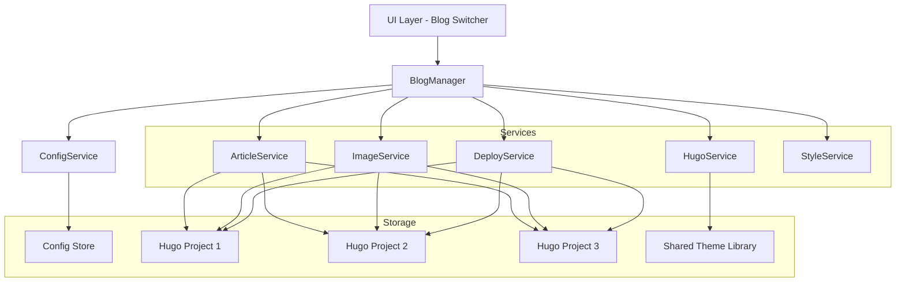
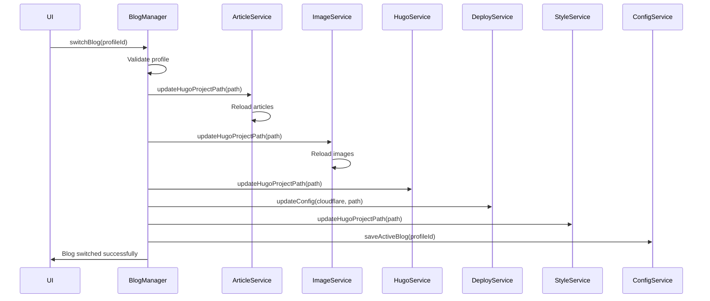

# Design Document: Multi-Blog Management

## Overview

The Multi-Blog Management feature extends the blog management application to support multiple independent Hugo-based blogs within a single application instance. This design enables users to maintain separate blogs for different purposes (personal, professional, project-specific) while sharing common infrastructure like themes and the application interface.

### Key Design Goals

1. **Profile-Based Architecture**: Each blog is represented as a profile containing Hugo project path, Cloudflare deployment settings, and metadata
2. **Dynamic Service Reconfiguration**: All services (ArticleService, ImageService, HugoService, DeployService, StyleService) dynamically reconfigure when switching between blogs
3. **Data Isolation**: Complete separation of content between blogs - no data leakage
4. **Shared Resources**: Common theme library and application infrastructure
5. **Backward Compatibility**: Seamless migration for existing single-blog users
6. **Minimal UI Disruption**: Blog switching integrated into existing interface without major redesign

### Architecture Approach

The design follows a **profile-based multi-tenancy pattern** where:
- A `BlogManager` component orchestrates profile management and switching
- Each blog profile encapsulates all configuration needed for independent operation
- Services maintain a single active context but can be reconfigured dynamically
- The UI layer remains largely unchanged, with a blog switcher component added to the toolbar

This approach avoids the complexity of running multiple blog contexts simultaneously while providing clean separation and easy switching.

## Architecture

### Component Overview



### BlogManager Component

The `BlogManager` is the central orchestrator responsible for:
- Maintaining the list of blog profiles
- Managing the active blog selection
- Coordinating service reconfiguration when switching blogs
- Validating blog profiles
- Handling profile CRUD operations

**Key Responsibilities:**
1. Load blog profiles from ConfigService on startup
2. Set and persist the active blog
3. Notify services when active blog changes
4. Validate Hugo project paths and configurations
5. Handle migration from single-blog to multi-blog configuration

### Service Reconfiguration Pattern

When the active blog changes, BlogManager follows this sequence:



Each service exposes an update method that:
1. Updates internal path/configuration references
2. Clears cached data
3. Reloads data from the new Hugo project
4. Returns success/failure status

### Data Flow

**Blog Profile Creation:**
1. User provides profile name, Hugo project path, and Cloudflare settings
2. BlogManager validates the Hugo project structure
3. Profile is saved to ConfigService
4. Profile appears in blog switcher dropdown

**Blog Switching:**
1. User selects a blog from the switcher
2. BlogManager validates the profile is still valid
3. Services are reconfigured sequentially
4. UI updates to reflect new active blog
5. Active blog ID is persisted

**Service Operations:**
- All service operations (create article, upload image, deploy, etc.) operate on the active blog's Hugo project
- No changes needed to existing service APIs
- Services remain stateless regarding which blog they're operating on

## Components and Interfaces

### BlogProfile Interface

```typescript
interface BlogProfile {
  id: string;                    // Unique identifier (UUID)
  name: string;                  // Internal name (unique, kebab-case)
  displayName: string;           // User-friendly display name
  hugoProjectPath: string;       // Absolute path to Hugo project
  cloudflare: CloudflareConfig;  // Deployment configuration
  description?: string;          // Optional description
  icon?: string;                 // Optional icon identifier
  color?: string;                // Optional color (hex)
  createdAt: Date;              // Creation timestamp
  lastAccessedAt: Date;         // Last access timestamp
  metadata?: Record<string, any>; // Extensible metadata
}
```

### BlogManager Class

```typescript
class BlogManager {
  private profiles: Map<string, BlogProfile>;
  private activeBlogId: string | null;
  private configService: ConfigService;
  private services: ServiceRegistry;
  
  constructor(
    configService: ConfigService,
    services: ServiceRegistry
  );
  
  // Profile Management
  async createProfile(data: CreateBlogProfileData): Promise<BlogProfile>;
  async updateProfile(id: string, updates: Partial<BlogProfile>): Promise<BlogProfile>;
  async deleteProfile(id: string): Promise<void>;
  getProfile(id: string): BlogProfile | null;
  listProfiles(): BlogProfile[];
  
  // Blog Switching
  async switchBlog(profileId: string): Promise<void>;
  getActiveBlog(): BlogProfile | null;
  getActiveBlogId(): string | null;
  
  // Validation
  async validateProfile(profile: BlogProfile): Promise<ValidationResult>;
  async validateHugoProject(path: string): Promise<ValidationResult>;
  
  // Import/Export
  async exportProfile(id: string, includeSensitive: boolean): Promise<string>;
  async importProfile(json: string): Promise<BlogProfile>;
  
  // Hugo Project Initialization
  async initializeHugoProject(path: string, options: HugoInitOptions): Promise<void>;
  
  // Migration
  async migrateFromSingleBlog(): Promise<BlogProfile>;
}
```

### ServiceRegistry Interface

```typescript
interface ServiceRegistry {
  articleService: ArticleService;
  imageService: ImageService;
  hugoService: HugoService;
  deployService: DeployService;
  styleService: StyleService;
}
```

### Service Update Methods

Each service needs to implement a reconfiguration method:

```typescript
// ArticleService
class ArticleService {
  async updateHugoProjectPath(path: string): Promise<void>;
}

// ImageService
class ImageService {
  async updateHugoProjectPath(path: string): Promise<void>;
}

// HugoService
class HugoService {
  async updateHugoProjectPath(path: string): Promise<void>;
}

// DeployService
class DeployService {
  async updateConfig(cloudflare: CloudflareConfig, hugoProjectPath: string): Promise<void>;
}

// StyleService
class StyleService {
  async updateHugoProjectPath(path: string): Promise<void>;
}
```

### BlogSwitcher UI Component

```typescript
interface BlogSwitcherProps {
  profiles: BlogProfile[];
  activeBlogId: string | null;
  onSwitch: (profileId: string) => Promise<void>;
  onCreate: () => void;
  onEdit: (profileId: string) => void;
  onDelete: (profileId: string) => void;
}
```

### IPC Handlers

New IPC channels for blog management:

```typescript
// Main process handlers
ipcMain.handle('blog:list-profiles', async () => BlogProfile[]);
ipcMain.handle('blog:get-active', async () => BlogProfile | null);
ipcMain.handle('blog:switch', async (event, profileId: string) => void);
ipcMain.handle('blog:create-profile', async (event, data: CreateBlogProfileData) => BlogProfile);
ipcMain.handle('blog:update-profile', async (event, id: string, updates: Partial<BlogProfile>) => BlogProfile);
ipcMain.handle('blog:delete-profile', async (event, id: string) => void);
ipcMain.handle('blog:validate-path', async (event, path: string) => ValidationResult);
ipcMain.handle('blog:export-profile', async (event, id: string, includeSensitive: boolean) => string);
ipcMain.handle('blog:import-profile', async (event, json: string) => BlogProfile);
ipcMain.handle('blog:initialize-hugo', async (event, path: string, options: HugoInitOptions) => void);
```

## Data Models

### BlogProfile Storage

Blog profiles are stored in the ConfigService as part of AppConfig:

```typescript
interface AppConfig {
  version: string;
  // Legacy single-blog fields (for backward compatibility)
  hugoProjectPath?: string;
  cloudflare?: CloudflareConfig;
  
  // Multi-blog fields
  blogs?: {
    profiles: BlogProfile[];
    activeBlogId: string | null;
  };
  
  editor: EditorPreferences;
  window: WindowState;
  recentProjects: string[];
}
```

### Migration Strategy

For backward compatibility, the config structure supports both old and new formats:

**Old Format (Single Blog):**
```json
{
  "version": "1.0.0",
  "hugoProjectPath": "/path/to/blog",
  "cloudflare": {
    "apiToken": "...",
    "accountId": "...",
    "projectName": "..."
  }
}
```

**New Format (Multi Blog):**
```json
{
  "version": "1.0.0",
  "blogs": {
    "profiles": [
      {
        "id": "uuid-1",
        "name": "personal-blog",
        "displayName": "Personal Blog",
        "hugoProjectPath": "/path/to/blog",
        "cloudflare": { ... },
        "createdAt": "2024-01-01T00:00:00Z",
        "lastAccessedAt": "2024-01-15T10:30:00Z"
      }
    ],
    "activeBlogId": "uuid-1"
  }
}
```

**Migration Logic:**
1. On startup, check if `blogs` field exists
2. If not, check if `hugoProjectPath` exists (old format)
3. If old format detected, create a default profile with existing settings
4. Set the migrated profile as active
5. Save the new format
6. Keep old fields for one version to allow rollback

### Validation Rules

**Profile Name Validation:**
- Must be unique across all profiles
- Must be non-empty
- Should be kebab-case for consistency (enforced by UI)

**Hugo Project Path Validation:**
- Path must exist
- Must contain `content` directory
- Must contain `themes` directory or theme configuration
- Must contain `hugo.toml`, `hugo.yaml`, or `config.toml`
- Must contain `static` directory

**Cloudflare Config Validation:**
- API token must be non-empty
- Account ID must be non-empty
- Project name must be non-empty
- Credentials should be validated against Cloudflare API before saving

### Profile Ordering

Profiles are displayed in the switcher sorted by:
1. Last accessed date (most recent first) - default
2. Custom order (if user has manually reordered)
3. Creation date (fallback)

### Shared Theme Library

Themes remain in a shared location outside individual Hugo projects:
- Location: `<app-data>/themes/` or configurable shared path
- Each Hugo project's `hugo.toml` references themes via `theme` parameter
- ThemeService operates on shared theme library
- Blog-specific theme customizations stored in each Hugo project's `assets/css/extended/` directory


## Correctness Properties

*A property is a characteristic or behavior that should hold true across all valid executions of a system—essentially, a formal statement about what the system should do. Properties serve as the bridge between human-readable specifications and machine-verifiable correctness guarantees.*

### Property Reflection

After analyzing all acceptance criteria, I identified several redundancies:
- **4.1 and 4.3** both test article isolation - combined into Property 4
- **4.6** is a general goal covered by Properties 4, 5, and 6 - removed
- **1.2 and 8.1** both test path existence validation - combined into Property 1
- **5.4** describes automatic behavior (shared location) rather than testable property - removed

### Property 1: Profile persistence round-trip

*For any* blog profile with valid data, creating it and then retrieving it from storage should return a profile with all the same field values (name, displayName, hugoProjectPath, cloudflare config, metadata).

**Validates: Requirements 1.1, 1.4**

### Property 2: Hugo project path validation

*For any* path provided during profile creation, the BlogManager should accept it only if the path exists on the filesystem and reject non-existent paths with an appropriate error.

**Validates: Requirements 1.2, 8.1**

### Property 3: Profile name uniqueness

*For any* existing profile name, attempting to create a new profile with the same name should fail with a uniqueness error, and the profile list should remain unchanged.

**Validates: Requirements 1.3**

### Property 4: Profile deletion preserves Hugo files

*For any* blog profile, deleting it should remove the profile from configuration storage but leave all files in the Hugo project directory unchanged.

**Validates: Requirements 1.5**

### Property 5: Profile updates are persisted

*For any* blog profile and any valid update to its metadata (name, displayName, hugoProjectPath, cloudflare config), applying the update and retrieving the profile should reflect the updated values.

**Validates: Requirements 1.6**

### Property 6: Active blog state persistence

*For any* blog profile, setting it as active and then restarting the application should result in the same profile being active on startup.

**Validates: Requirements 2.2, 2.5, 2.6**

### Property 7: Service reconfiguration on blog switch

*For any* two different blog profiles, switching from one to another should result in all services (ArticleService, ImageService, HugoService, DeployService, StyleService) having their Hugo project paths updated to the new blog's path.

**Validates: Requirements 2.3, 3.1, 3.2, 3.3, 3.4, 3.5**

### Property 8: Failed switch preserves previous state

*For any* active blog and any invalid target blog, attempting to switch to the invalid blog should fail and leave the original blog as the active blog.

**Validates: Requirements 3.6**

### Property 9: Article isolation between blogs

*For any* two different blog profiles with different Hugo projects, articles from blog A should not appear in the article list when blog B is active, and vice versa.

**Validates: Requirements 4.1, 4.3**

### Property 10: Image isolation between blogs

*For any* two different blog profiles with different Hugo projects, images from blog A should not appear in the image list when blog B is active, and vice versa.

**Validates: Requirements 4.2**

### Property 11: Tag isolation between blogs

*For any* two different blog profiles with different Hugo projects, tags from blog A should not appear in the tag list when blog B is active, and vice versa.

**Validates: Requirements 4.4**

### Property 12: Category isolation between blogs

*For any* two different blog profiles with different Hugo projects, categories from blog A should not appear in the category list when blog B is active, and vice versa.

**Validates: Requirements 4.5**

### Property 13: Shared theme library configuration

*For any* newly initialized Hugo project, the hugo.toml configuration file should reference the shared theme library path, making themes available to the project.

**Validates: Requirements 5.2**

### Property 14: Theme application independence

*For any* blog profile and any theme from the shared library, applying the theme should succeed regardless of which blog is currently active.

**Validates: Requirements 5.3**

### Property 15: Blog-specific customizations are isolated

*For any* two different blog profiles, theme customizations applied to blog A should not affect the appearance of blog B.

**Validates: Requirements 5.5**

### Property 16: Deployment profile isolation

*For any* blog profile, its deployment profile (Cloudflare config) should be independent and different profiles can have different API tokens, account IDs, and project names.

**Validates: Requirements 6.1, 6.2, 6.6**

### Property 17: Deployment uses active blog's credentials

*For any* blog profile that is active, initiating a deployment should use that blog's Cloudflare configuration (API token, account ID, project name) and not any other blog's configuration.

**Validates: Requirements 6.3**

### Property 18: Deployment credentials are validated on switch

*For any* blog profile with invalid Cloudflare credentials, attempting to switch to that blog should detect the invalid credentials and report an error.

**Validates: Requirements 6.5**

### Property 19: Hugo project structure validation

*For any* path provided during profile creation, the BlogManager should accept it only if it contains the required directories (content, themes, static) and a Hugo configuration file (hugo.toml, hugo.yaml, or config.toml).

**Validates: Requirements 8.2, 8.3**

### Property 20: Validation error messages are specific

*For any* validation failure during profile creation, the error message should specifically indicate which validation check failed (missing directory, missing config file, invalid credentials, etc.).

**Validates: Requirements 8.4**

### Property 21: Invalid credentials are rejected

*For any* Cloudflare configuration with invalid credentials (empty token, empty account ID, or credentials that fail API validation), the BlogManager should reject the profile creation with an appropriate error.

**Validates: Requirements 8.5**

### Property 22: Invalid profiles are marked unavailable

*For any* blog profile that becomes invalid (Hugo project deleted, path changed, etc.), the BlogManager should mark it as unavailable and prevent switching to it.

**Validates: Requirements 8.6**

### Property 23: Configuration migration preserves data

*For any* old-format configuration (single blog), migrating to the new format should create a profile containing the same hugoProjectPath and Cloudflare configuration, and set it as the active blog.

**Validates: Requirements 9.1, 9.2, 9.3, 9.4**

### Property 24: Profile export/import round-trip

*For any* blog profile (excluding sensitive data), exporting it to JSON and then importing the JSON should create a profile with equivalent data (name, displayName, hugoProjectPath, description, icon, color).

**Validates: Requirements 10.1, 10.3**

### Property 25: Export excludes sensitive data by default

*For any* blog profile with Cloudflare credentials, exporting without the includeSensitive flag should produce JSON that does not contain the API token.

**Validates: Requirements 10.2**

### Property 26: Import validates profile structure

*For any* JSON data that doesn't match the BlogProfile schema (missing required fields, invalid types), attempting to import it should fail with a validation error.

**Validates: Requirements 10.4**

### Property 27: Import rejects duplicate names

*For any* existing profile name, attempting to import a profile with the same name should fail with a uniqueness error.

**Validates: Requirements 10.6**

### Property 28: Hugo initialization creates required structure

*For any* valid directory path, initializing a new Hugo project should create the required directories (content, themes, static, layouts) and a hugo.toml configuration file.

**Validates: Requirements 11.3, 11.5**

### Property 29: Initialized project references shared themes

*For any* newly initialized Hugo project, the hugo.toml file should contain configuration that references the shared theme library path.

**Validates: Requirements 11.4**

### Property 30: Failed initialization cleans up

*For any* Hugo initialization that fails (invalid path, permission error, Hugo command failure), any partially created files or directories should be removed.

**Validates: Requirements 11.6**

### Property 31: Optional metadata fields are preserved

*For any* blog profile with optional fields (description, icon, color), creating or updating the profile should preserve these fields when retrieving the profile.

**Validates: Requirements 12.1, 12.2**

### Property 32: Custom profile ordering is preserved

*For any* custom ordering of blog profiles, saving the order and restarting the application should restore the same ordering.

**Validates: Requirements 12.4**

### Property 33: Last accessed date is updated on switch

*For any* blog profile, switching to it should update its lastAccessedAt timestamp to the current time.

**Validates: Requirements 12.5**

### Property 34: Default sorting by last accessed

*For any* list of blog profiles without custom ordering, they should be sorted by lastAccessedAt in descending order (most recently accessed first).

**Validates: Requirements 12.6**

## Error Handling

### Profile Management Errors

**Invalid Hugo Project Path:**
- Error: "Hugo project path does not exist: {path}"
- Recovery: Prompt user to select a valid path
- Logging: Log the attempted path and validation failure

**Missing Required Directories:**
- Error: "Hugo project is missing required directories: {missing_dirs}"
- Recovery: Offer to initialize the project or select a different path
- Logging: Log the path and missing directories

**Duplicate Profile Name:**
- Error: "A profile with the name '{name}' already exists"
- Recovery: Prompt user to choose a different name
- Logging: Log the attempted duplicate name

**Invalid Cloudflare Credentials:**
- Error: "Cloudflare credentials validation failed: {reason}"
- Recovery: Prompt user to re-enter credentials
- Logging: Log validation failure (without logging sensitive credentials)

### Blog Switching Errors

**Profile Not Found:**
- Error: "Blog profile '{id}' not found"
- Recovery: Revert to previous active blog or default blog
- Logging: Log the missing profile ID

**Service Reconfiguration Failure:**
- Error: "Failed to reconfigure {service_name}: {error_message}"
- Recovery: Rollback to previous active blog
- Logging: Log the service name, error, and rollback action

**Invalid Profile State:**
- Error: "Blog profile '{name}' is invalid: {reason}"
- Recovery: Mark profile as unavailable, prevent switching
- Logging: Log the profile ID and validation failure reason

### Import/Export Errors

**Invalid JSON Format:**
- Error: "Invalid profile JSON: {parse_error}"
- Recovery: Prompt user to check the file format
- Logging: Log the parse error

**Missing Required Fields:**
- Error: "Profile JSON is missing required fields: {missing_fields}"
- Recovery: Reject import, show validation errors
- Logging: Log the missing fields

**Path Not Found During Import:**
- Error: "Hugo project path in imported profile does not exist: {path}"
- Recovery: Prompt user to select a new path or cancel import
- Logging: Log the missing path and user's choice

### Hugo Initialization Errors

**Directory Creation Failed:**
- Error: "Failed to create Hugo project directory: {error}"
- Recovery: Clean up partial files, prompt user to check permissions
- Logging: Log the error and cleanup actions

**Hugo Command Failed:**
- Error: "Hugo initialization command failed: {command_output}"
- Recovery: Clean up partial files, show Hugo error output
- Logging: Log the Hugo command and its output

**Permission Denied:**
- Error: "Permission denied when creating Hugo project at: {path}"
- Recovery: Prompt user to select a different location
- Logging: Log the path and permission error

### General Error Handling Principles

1. **User-Friendly Messages**: All errors shown to users should be clear and actionable
2. **Detailed Logging**: All errors should be logged with full context for debugging
3. **Graceful Degradation**: System should remain functional even when individual profiles fail
4. **Rollback on Failure**: Failed operations should not leave the system in an inconsistent state
5. **Sensitive Data Protection**: Error messages and logs should never expose API tokens or passwords

## Testing Strategy

### Dual Testing Approach

This feature requires both unit tests and property-based tests for comprehensive coverage:

**Unit Tests** focus on:
- Specific examples of profile creation, update, and deletion
- UI component rendering with different profile states
- Migration from old to new configuration format
- Error handling for specific failure scenarios
- Integration between BlogManager and services

**Property-Based Tests** focus on:
- Universal properties that hold across all valid inputs
- Data isolation between blogs
- Round-trip properties (export/import, persistence)
- Validation logic with randomly generated valid/invalid inputs
- Service reconfiguration with various blog configurations

### Property-Based Testing Configuration

**Library Selection:**
- TypeScript/JavaScript: Use `fast-check` library
- Minimum 100 iterations per property test
- Each test tagged with: `Feature: multi-blog-management, Property {number}: {property_text}`

**Example Property Test Structure:**

```typescript
import fc from 'fast-check';

// Feature: multi-blog-management, Property 1: Profile persistence round-trip
test('profile persistence round-trip', async () => {
  await fc.assert(
    fc.asyncProperty(
      blogProfileArbitrary(),
      async (profile) => {
        // Create profile
        const created = await blogManager.createProfile(profile);
        
        // Retrieve profile
        const retrieved = await blogManager.getProfile(created.id);
        
        // Assert all fields match
        expect(retrieved).toMatchObject({
          name: profile.name,
          displayName: profile.displayName,
          hugoProjectPath: profile.hugoProjectPath,
          cloudflare: profile.cloudflare
        });
      }
    ),
    { numRuns: 100 }
  );
});
```

### Test Data Generators

**BlogProfile Generator:**
```typescript
const blogProfileArbitrary = () => fc.record({
  name: fc.stringOf(fc.constantFrom('a-z', '0-9', '-'), { minLength: 3, maxLength: 30 }),
  displayName: fc.string({ minLength: 1, maxLength: 50 }),
  hugoProjectPath: fc.constantFrom('/valid/path/1', '/valid/path/2', '/valid/path/3'),
  cloudflare: cloudflareConfigArbitrary(),
  description: fc.option(fc.string({ maxLength: 200 })),
  icon: fc.option(fc.constantFrom('blog', 'book', 'code', 'star')),
  color: fc.option(fc.hexaString({ minLength: 6, maxLength: 6 }))
});
```

### Unit Test Coverage

**BlogManager Tests:**
- Profile CRUD operations
- Active blog switching
- Validation logic
- Migration from old config format
- Import/export functionality
- Hugo project initialization

**Service Reconfiguration Tests:**
- ArticleService path update and reload
- ImageService path update and reload
- HugoService path update
- DeployService config and path update
- StyleService path update

**UI Component Tests:**
- BlogSwitcher rendering with different profile counts
- Profile creation form validation
- Profile edit form
- Dropdown interaction
- Keyboard shortcuts

**Integration Tests:**
- End-to-end blog switching flow
- Profile creation with Hugo initialization
- Deployment with different blog profiles
- Migration on first startup

### Edge Cases and Error Conditions

Unit tests should specifically cover:
- Creating profile with empty name
- Creating profile with non-existent path
- Creating profile with invalid Cloudflare credentials
- Switching to non-existent profile
- Deleting the currently active profile
- Importing profile with missing fields
- Importing profile with duplicate name
- Hugo initialization in directory without write permissions
- Service reconfiguration failure and rollback
- Configuration file corruption recovery

### Test Environment Setup

**Test Fixtures:**
- Multiple temporary Hugo project directories
- Mock Cloudflare API responses
- Sample configuration files (old and new format)
- Sample export JSON files

**Cleanup:**
- Remove temporary directories after tests
- Reset ConfigService state between tests
- Clear in-memory caches

### Performance Testing

While not part of correctness properties, performance should be monitored:
- Blog switching should complete in < 500ms
- Profile list loading should complete in < 100ms
- Hugo project validation should complete in < 200ms
- Service reconfiguration should be atomic (all or nothing)

